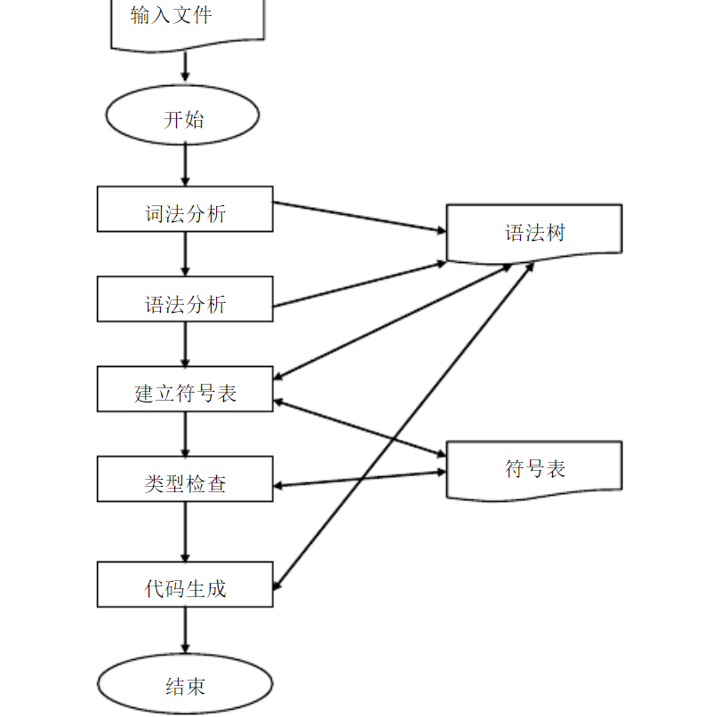

# Grape - C Complier

一个简单的C语言编译器

- 项目介绍：这是一个编译原理的大作业
- 团队成员：陈钰鼎、柳鑫、孟程昊、秦寅畅、祝鹏天
- 完成时间：2020.12.28

分工情况

- 词法分析: 陈钰鼎、孟程昊
- 语法分析: 柳鑫、秦寅畅
- 类型检查: 祝鹏天
- 代码优化: 柳鑫
- 错误分析: 柳鑫
- 汇编程序: 祝鹏天
- 符号表: 祝鹏天

加分项

- 支持函数调用
- 支持数组运算（一维数组、二维数组）

## 运行

环境要求：flex bison g++11 python3 jdk-14

工具：Mars（汇编器）

#### 中间代码生成
运行 test 文件夹下的 order.sh
```
flex syntax3.l
echo "Flex Over"
bison -vdty compiler2.y
echo "Yacc Over"
g++ -std=c++11 -o compiler ../source/TableNode.cpp tree.cpp Praser.cpp middleCode.cpp tools.cpp Optimize.cpp lex.yy.c y.tab.c
echo "compiler Over"
./compiler test.c
```

#### 目标代码生成
运行 mips 文件夹下的 order.sh
```
cp ../test/innerCode.txt inter.txt
python3 objectcode.py
java -jar Mars4_5.jar
```

生成的目标代码在 result.asm 中

在 Mars 中运行 result.asm 文件

## 测试
测试者可以选择更改 /test/order.sh 第7行中的测试文件名，来修改测试文件（默认test.c）

- test.c: 支持了实验的全部基本要求，以及二维数组计算和函数调用
- test1.c: 符号表的重定义和错误分析
- test2.c: 类型检查和错误分析

## 项目架构


## 主要思路
#### 词法分析

lex: syntax3.l

这里把待测试文件看成一个字符串，分离出一个个token

然后返回对应的值，同时也会得到关键字的所在行数便于查找
```
if               {count(); yylval.gt =create_tree("IF",0,yylineno); return (IF);}
else             {count(); yylval.gt =create_tree("ELSE",0,yylineno); return (ELSE);}
while            {count(); yylval.gt =create_tree("WHILE",0,yylineno); return (WHILE);}
do               {count(); yylval.gt =create_tree("DO",0,yylineno); return (DO);}
for              {count(); yylval.gt =create_tree("FOR",0,yylineno); return (FOR);}
continue         {count(); yylval.gt =create_tree("CONTINUE",0,yylineno); return (CONTINUE);}
break            {count(); yylval.gt =create_tree("BREAK",0,yylineno); return (BREAK);}
return           {count(); yylval.gt =create_tree("RETURN",0,yylineno); return (RETURN);}
char             {count(); yylval.gt =create_tree("CHAR",0,yylineno); return (CHAR);}
int              {count(); yylval.gt =create_tree("INT",0,yylineno); return (INT);}
double           {count(); yylval.gt =create_tree("DOUBLE",0,yylineno); return (DOUBLE);}
void             {count(); yylval.gt =create_tree("VOID",0,yylineno); return (VOID);}
bool             {count(); yylval.gt =create_tree("BOOL",0,yylineno); return (BOOL);}
true             {count(); yylval.gt =create_tree("TRUE",0,yylineno); return (TRUE);}
false            {count(); yylval.gt =create_tree("FALSE",0,yylineno); return (FALSE);}
{const_int}      {count(); yylval.gt =create_tree("CONSTANT_INT",0,yylineno); return (CONSTANT_INT);}
{const_double}   {count(); yylval.gt =create_tree("CONSTANT_DOUBLE",0,yylineno); return (CONSTANT_DOUBLE);}
```

正规定义:
```
delim           [ \t \n]
ws              {delim}+
letter          [A-Za-z_]
digit           [0-9]
FS              (f|F|l|L)
I               ((u|U)|(u|U)?(l|L|ll|LL)|(l|L|ll|LL)(u|U))
const_int       [0-9]{digit}*{IS}?
const_double    {digit}+(\.{digit}+)?(E[+-]?{digit}+)?
id              {letter}({letter}|{digit})*
```

#### 语法分析
定义tree.cpp，通过文法和其他规则建立语法树

创建compiler2.y文件，建立树结构

e.g.
```
//循环语句
iteration_statement:
	WHILE '(' expression ')' statement {
		$$ = create_tree("iteration_statement",5,$1,$2,$3,$4,$5);
	}
	| DO statement WHILE '(' expression ')' ';' {
		$$ = create_tree("iteration_statement",7,$1,$2,$3,$4,$5,$6,$7);
	}
	| FOR wait_block  '(' expression_statement expression_statement ')' statement {
		$$ = create_tree("iteration_statement",6,$1,$3,$4,$5,$6,$7);
		printf("open  space");
	}
	| FOR wait_block  '(' expression_statement expression_statement expression ')' statement {
		$$ = create_tree("iteration_statement",7,$1,$3,$4,$5,$6,$7,$8);
		printf("open  space");
	}
	| FOR wait_block  '(' declaration expression_statement ')' statement {
		$$ = create_tree("iteration_statement",6,$1,$3,$4,$5,$6,$7);
		printf("open  space");
	}
	| FOR wait_block  '(' declaration expression_statement expression ')' statement {
		$$ = create_tree("iteration_statement",7,$1,$3,$4,$5,$6,$7,$8);
		printf("open  space");
	}
	;
```

#### 符号表
建立 TableNode.cpp 文件
```c++
int *TableNode::isHave(string id);               //检测是否存在该id
void TableNode::addFather(TableNode *father);    //提供父亲节点
TableNode *TableNode::addChild();                //开辟子空间、孩子节点用于新的内存分配
TableNode *TableNode::deleteSelf();              //关闭子空间，返回父亲节点
int *TableNode::addChar(string id);              //给id分配空间
TableNode *TableNode::addFunction(string id);    //用于增加一个函数的根符号表
TableNode *TableNode::getFunction;               //获得一个函数根符号表的拷贝
```

#### 中间代码生成
根据下列S语言的语法规则，从左到右扫描表达式，翻译S语言，生成中间代码
- <程序>→[<常量说明>][<变量说明>]<语句>
- <常量说明>→Const <常量定义>{，<常量定义>}；
- <常量定义>→<标识符>＝<无符号整数>
- <无符号整数>→<数字>{<数字>}
- <字母>→a|b|c| … |z
- <数字>→0|1|2| … |9
- <标识符>→<字母>{<字母>|<数字>}
- <变量说明>→Var <标识符>{，<标识符>}；
- <语句>→<赋值语句>|<条件语句>|<当循环语句>|<复合语句>|ε
- <赋值语句>→<标识符>＝<表达式>;
- <表达式>→[＋|－]<项>{<加法运算符><项>}
- <项>→<因子>{<乘法运算符><因子>}
- <因子>→<标识符>|<无符号整数>|‘(’<表达式>‘)’
- <加法运算符>→＋|－
- <乘法运算符>→* |／
- <条件语句>→if <条件> then <语句>| if <条件> then <语句> else <语句>
- <条件>→<表达式><关系运算符><表达式>
- <关系运算符>→＝＝|＜＝|＜|＞|＞＝|＜＞
- <当循环语句>→while <条件> do <语句>
- <复合语句>→begin <语句>{；<语句>} end

#### 中间代码格式
| 语法  | 描述 |
| :---: | :---- |
| x := y | 赋值操作，将变量 y 赋值给 x | 
| x := &y |  取地址操作，将 y 的地址赋值给 x | 
| x := *y | 取以 y 值为地址的内存单元的内容赋给 x | 
| *x := y | 将 y 值赋给以 x 值为地址的内存单元 | 
| LABEL label1 : | 定义标签 label1  |
| GOTO label1| 无条件跳转至 lable1 | 
| IF x [relop] y GOTO z | 如果 x 与 y 满足[relop]关系则跳转至标号 z | 
| x := y [op] z | 将变量 y 和 z 进行 op 运算的结果传递给 x | 
| x := #10 | 将立即数 10 的值传递给变量 x | 
| FUNCTION f :  | 定义函数 f  | 
| RETURN x | 退出当前函数并返回 x 值 | 
| DEC x [size] | 内存空间申请，大小为[size] | 
| ARG x | 为函数传入实参 x | 
| x := CALL f | 调用函数 f，并将其返回值赋给 x | 
| CALL f | 调用函数 f | 
| PARAM x | 函数形参声明 | 

#### 代码优化
消除全局公共子表达式
```c++
class Optimize
{
    private:
        vector<string> codelist;
        map<string, Message> tempMessage;
        void establishMap(vector<string>&);         //建立temp和次数，行数的map
        void dropTrumpTemp(vector<string>&);        //除去无用的临时变量(全局公共子表达式)
    
    public:
        Optimize(vector<string>);
        vector<string> getCodeList();
};
```

#### 汇编程序
建立函数
```
Load_Var(Inter)         #  找到所有须用寄存器替代的变量
Load_Inter(filename)    # 分割生成的中间代码，将每行代码转成一个存储各个关键字的列表
Get_R(string)           # 为variables中的变量分配寄存器
def write_to_txt(Obj)   # 将最终转换结果写到result.asm文件中
translate(line)         # 给元素赋值、进行数组操作、传参
```

转换的程序入口
```
def parser():
    for reg in regs:
        reg_ok[reg] = 1                 # 初始化，所有寄存器都可用
    Inter = Load_Inter('inter.txt')     # 读取中间代码
    Load_Var(Inter)                     # 第一遍扫描，记录所有变量
    Obj = []                            # 存储最终转换结果
    for line in Inter:                  # 逐行进行转换
        obj_line = translate(line)      # 转换中间代码成MIPS汇编
        if obj_line == '':
            continue
        Obj.append(obj_line)
    write_to_txt(Obj)
```
